fpcard-slicer - A slicer for non-standard fingerprints cards
===========================
Is a application for to extract fingerprints of non-standard fingerprint card
# Building form sources
## Pre-requisites
### Linux
```sh
 $ [sudo] apt-get install build-essential autoconf libtool pkg-config libjpeg-dev libpng-dev
```
## Compile and run
### Linux
```sh
 $ git clone https://github.com/rnhdev/fpcard-slicer
 $ cd fpcard-slicer
 $ mkdir build 
 $ cd build
 $ cd cmake .. && make
 $ ./fpcard-slicer -s ../test -d ../test -q 10 -f jpg -o
 ```
## Options
* -h,--help:	Show help message
* -s,--source.	Specify the image source. Can be source file or directory path
* -d,--destination. Specify the destination path for output result
	-f,--format. Specify output format (png or jpeg)
	-q,--quality. Specify the output quality (only for jpg output available)
	-o,--demo. If is set, the partial result is output
## Limitations
Only supports scanned images in grayscale at 500 dpi with jpeg or png format
## Output example
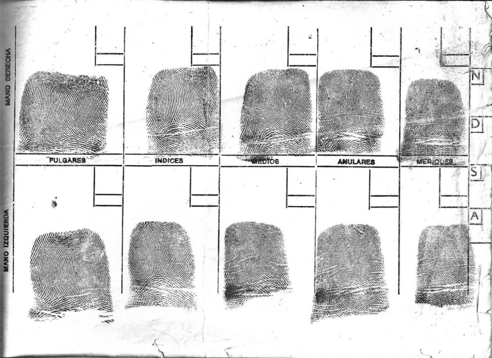
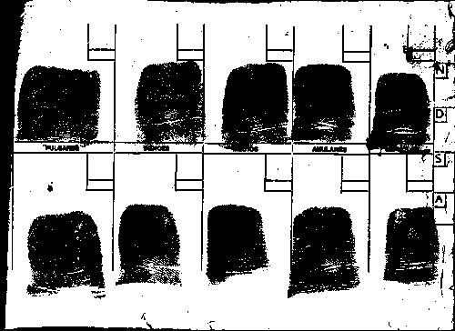
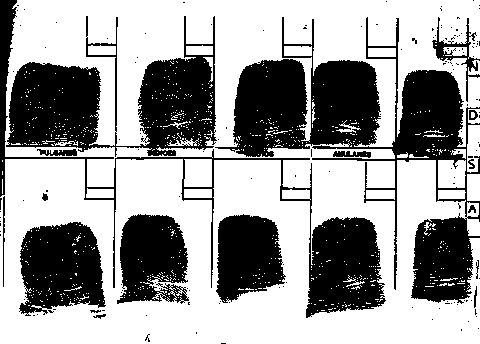
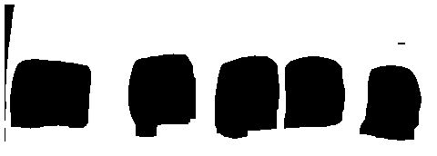
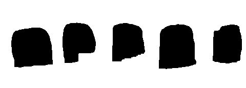
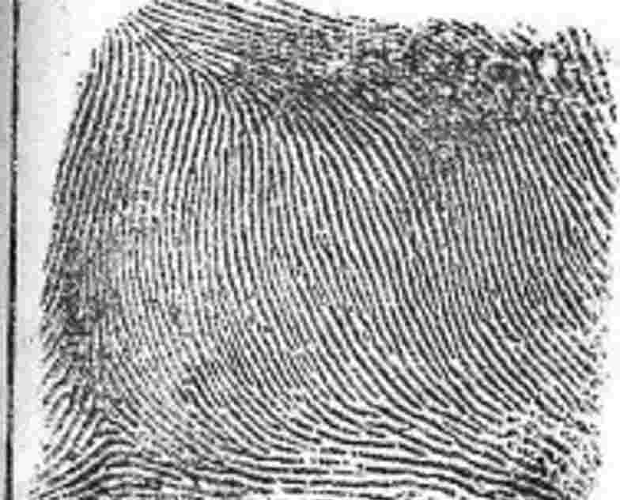
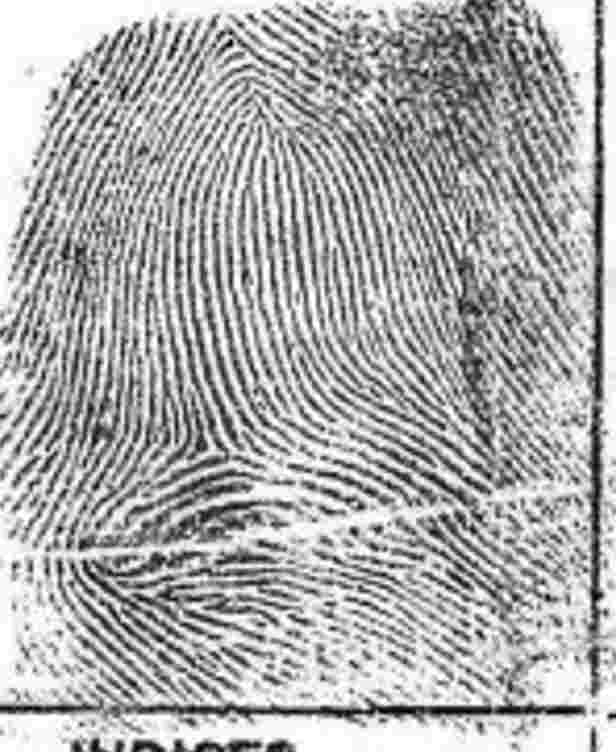
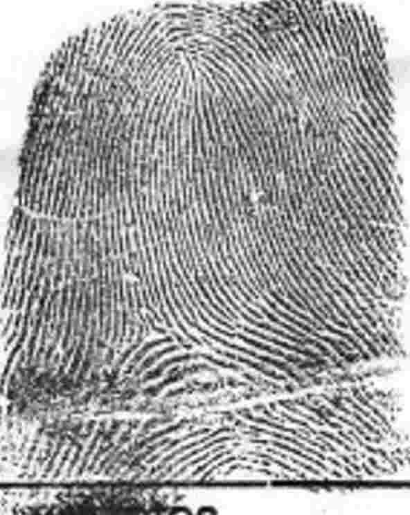
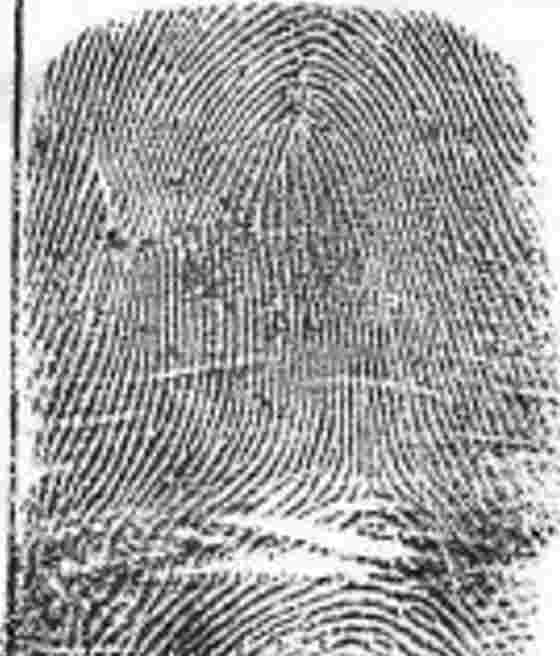
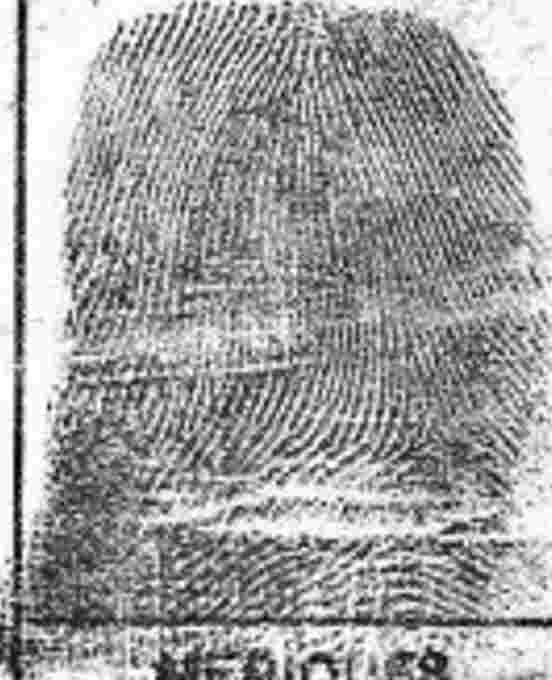
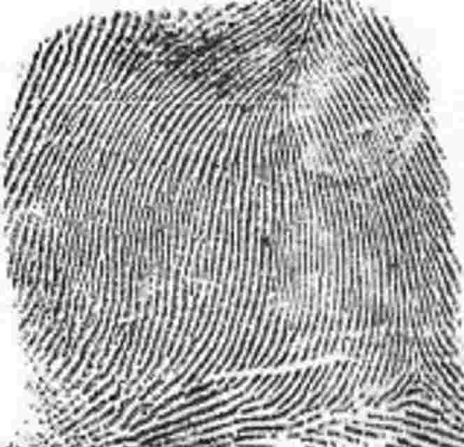
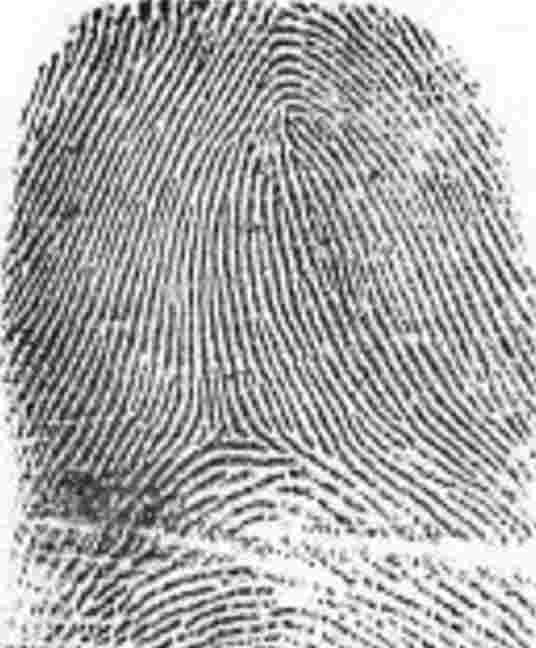
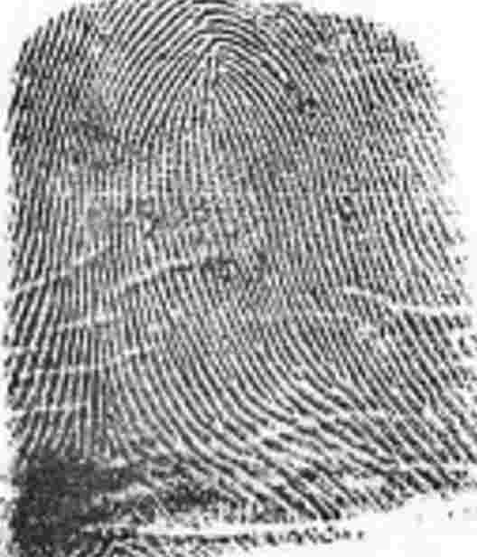
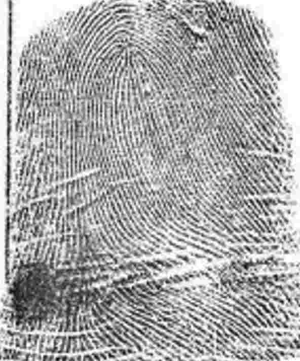
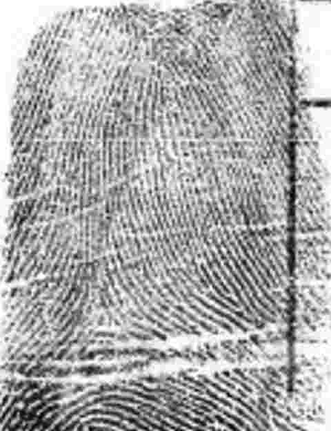
